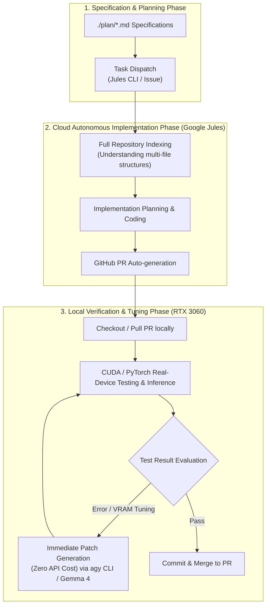

[English](jules_local_hybrid_pipeline.en.md) | [日本語](jules_local_hybrid_pipeline.md)

# Jules × agy CLI (Local GPU) Hybrid Development Pipeline

## 1. Overview

This architecture is a hybrid development model designed to rapidly build a high-quality codebase while minimizing cloud API token consumption and inference costs. It optimally orchestrates the **cloud-based autonomous coding agent (Google Jules)** and the **on-device local inference platform (RTX 3060 / agy CLI / Gemma 4)**.

### Development Cycle



---

## 2. Role Division and Design Principles for Token & Quality Optimization

| Responsibility | Assigned Agent / Environment | Selection Reason & Characteristics | Token / Cost Perspective |
|---|---|---|---|
| **Global Architecture Comprehension & Multi-component Implementation** | **Google Jules (Cloud)** | Autonomously executes large-scale refactoring and multi-directory file creation by understanding the entire repository and dependencies. | Utilizes the cloud's wide context window and powerful reasoning capabilities intensively only 1-2 times. |
| **Runtime Verification & Environment-Specific Debugging** | **RTX 3060 (Local Real-Device)** | Verifies the consistency of tensor operations specific to the local GPU, CUDA 12, PyTorch, and 12GB VRAM. | Real-device execution requires no API tokens. |
| **Local Patches, Fine-Tuning, Refactoring** | **agy CLI / Gemma 4 (Local AI)** | Modifies single functions, types, and unit tests via the Antigravity SDK (`LocalOpenAIAgentConfig`). | **Fully local inference (0 token consumption)**. Enables infinite small-scale trial-and-error loops. |

### Key Practices for Token Saving and Quality Assurance

1. **Delegate coarse-grained tasks to Jules, close micro-correction loops locally**:
   - Having Jules retry repeatedly for compile errors or minor syntax errors increases cloud-side turns and wait times.
   - Entrust Jules with the bulk creation of the "overall skeleton, interfaces, and initial tests" and have it output as a PR.
2. **Context Localization for Local LLM (Gemma 4)**:
   - Feeding the massive context of the entire repository to a local LLM leads to VRAM overflow and attention degradation.
   - By extracting only the "stack trace," "diff of a single target file," and "failed test cases" upon test failure and feeding them into the prompt, the local LLM can consistently achieve pinpoint patch accuracy comparable to Gemini Pro.

---

## 3. Specific Operational Procedures (Workflow Playbook)

### Step 1: Task Dispatch to Jules
Create component-level implementation instructions based on the specifications in the `plan/` directory, and send them using `jules remote new`.
```bash
# Start Jules session
jules remote new --session "Implement Ruri embedding provider and logit router based on plan/search_logit_sem.md"

# Monitor completion and PR creation
uv run python .agents/skills/jules-runner/scripts/watch_jules.py --repo chottokun/search_logit_sem
```

### Step 2: Local Checkout of PR
Once Jules creates a PR on GitHub, checkout the working branch locally.
```bash
gh pr checkout <PR_NUMBER>
# Or
jules remote pull --session <SESSION_ID>
```

### Step 3: RTX 3060 Real-Device Verification and agy CLI (Gemma 4) Auto-Patching
Run tests in the local virtual environment, and if errors occur, invoke the local model to apply patches.
```bash
# Run tests in virtual environment
uv run pytest tests/

# Auto-patching of failed sections (Example of headless execution using Gemma 4)
python scripts/local_patch_runner.py --error-log /tmp/pytest_error.log
```

---

## 4. Related Documents

* [Local AI Model Setup Guide (RTX 3060 / Gemma 4)](../infrastructure/local_llm_setup.md)
* [Jules Dispatch Guide](../infrastructure/jules_dispatch_guide.md)
* [RAG Logit Filtering Specs](../domain/logit_filter_spec.md)
