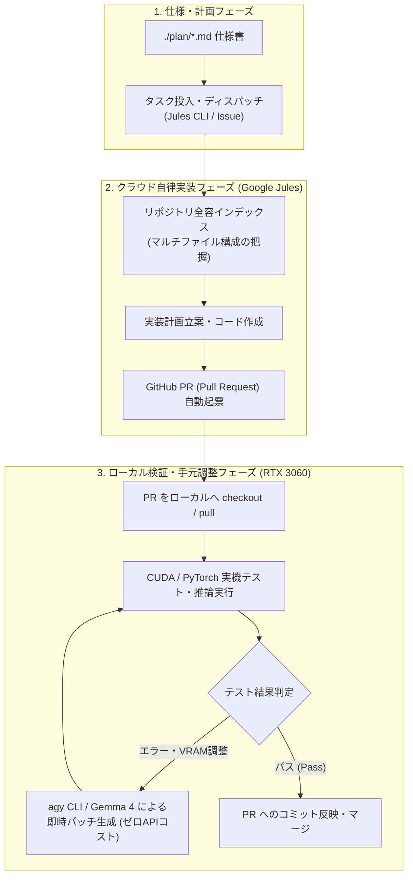

[English](jules_local_hybrid_pipeline.en.md) | [日本語](jules_local_hybrid_pipeline.md)

# Jules × agy CLI (Local GPU) ハイブリッド開発パイプライン

## 1. 概要

本アーキテクチャは、**クラウド型自律コーディングエージェント（Google Jules）** と **オンデバイス・ローカル推論基盤（RTX 3060 / agy CLI / Gemma 4）** を適材適所で協調させ、クラウドAPIトークン消費と推論コストを最小化しつつ、高品質なコードベースを短サイクルで構築するためのハイブリッド開発モデルです。

### 開発サイクル



---

## 2. 役割分担とトークン・品質最適化の設計原則

| 責務 | 担当エージェント・環境 | 選定理由と特性 | トークン / コスト観点 |
|---|---|---|---|
| **大局的アーキテクチャ把握 & 複数コンポーネント実装** | **Google Jules (Cloud)** | リポジトリ全体、依存関係、複数ディレクトリに跨るファイル新設・大規模リファクタリングを自律遂行 | クラウドの広いコンテキスト窓と強力な推論能力を集約的に1〜2回だけ利用。 |
| **実行時検証・環境依存デバッグ** | **RTX 3060 (ローカル実機)** | CUDA 12、PyTorch、VRAM 12GB、ローカルGPU固有のテンソル演算の整合性検証 | 実機実行のためAPIトークン不要。 |
| **局所パッチ・微調整・リファクタリング** | **agy CLI / Gemma 4 (Local AI)** | Antigravity SDK (`LocalOpenAIAgentConfig`) を通じた単一関数・型修正・単体テスト修正 | **完全ローカル推論 (トークン消費 0)**。小規模な試行錯誤ループを無限に実行可能。 |

### トークン節約と品質担保のキモ（ノウハウ）

1. **粗粒度のタスクをJulesに渡し、微小な修正ループはローカルに閉じる**:
   - Julesにコンパイルエラーや軽微な構文エラーの修正で何度も再試行させると、クラウド側のターン数や待ち時間が増大します。
   - 「全体の骨組み・インターフェース・初期テスト」の作成までをJulesに一括委託し、PRとして出力させます。
2. **ローカルLLM（Gemma 4）へのコンテキスト局所化**:
   - ローカルLLMにリポジトリ全体の巨大なコンテキストを渡すと、VRAM溢れやアテンション精度の低下を招きます。
   - テスト失敗時の「スタックトレース」「対象ファイル1つの差分」「失敗したテストケース」のみをプロンプトとして抽出し、ピンポイントにパッチを作成させることで、ローカルLLMでもGemini Pro級の修正精度を安定して発揮させます。

---

## 3. 具体的な運用手順 (Workflow Playbook)

### ステップ 1: Jules へのタスクディスパッチ
`plan/` ディレクトリ内の仕様から、コンポーネント単位の実装指示を作成し、`jules remote new` で送信します。
```bash
# Jules セッションの開始
jules remote new --session "Implement Ruri embedding provider and logit router based on plan/search_logit_sem.md"

# 完了・PR起票を監視
uv run python .agents/skills/jules-runner/scripts/watch_jules.py --repo chottokun/search_logit_sem
```

### ステップ 2: PR のローカルチェックアウト
Jules が GitHub 上で PR を作成したら、手元の作業ブランチにチェックアウトします。
```bash
gh pr checkout <PR番号>
# または
jules remote pull --session <SESSION_ID>
```

### ステップ 3: RTX 3060 実機検証と agy CLI (Gemma 4) 自動パッチ
ローカルの仮想環境でテストを実行し、エラーが発生した場合はローカルモデルを呼び出してパッチを適用します。
```bash
# 仮想環境下でのテスト実行
uv run pytest tests/

# 失敗箇所の自動パッチ (Gemma 4 を利用したヘッドレス実行例)
python scripts/local_patch_runner.py --error-log /tmp/pytest_error.log
```

---

## 4. 関連ドキュメント

* [ローカルAIモデル設定ガイド (RTX 3060 / Gemma 4)](../infrastructure/local_llm_setup.md)
* [Jules タスク投入規約](../infrastructure/jules_dispatch_guide.md)
* [RAG Logit フィルタリング仕様](../domain/logit_filter_spec.md)
